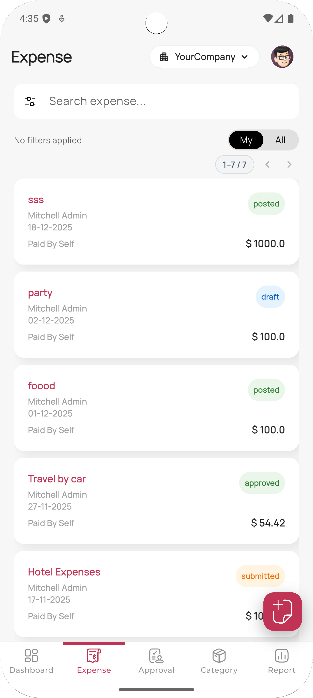
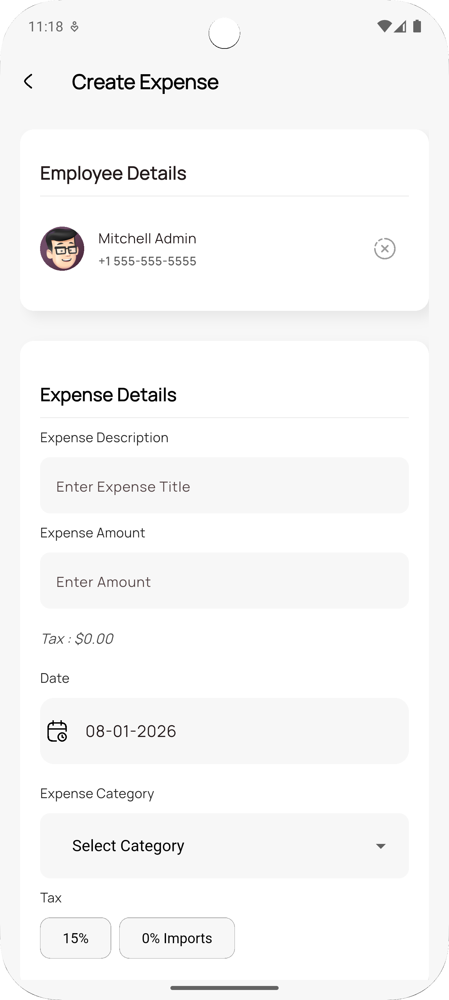
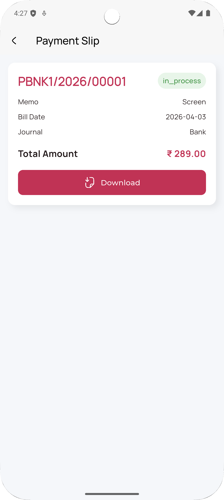
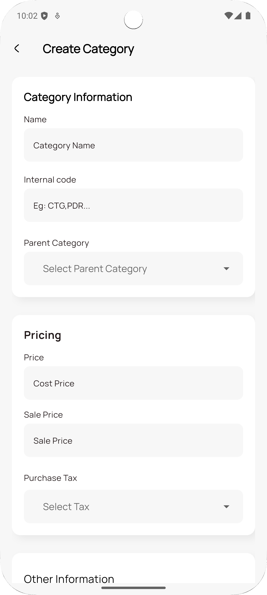

# Mobo Expenses


Mobo Expenses is a powerful mobile solution designed to seamlessly integrate with Odoo, streamlining expense management for businesses. Built with Flutter, it offers a user-friendly interface for employees to submit expenses and for managers to approve them, all synchronized in real-time with your Odoo backend.

##  Key Features

###  Effortless Expense Tracking
- **Quick Creation**: Create expenses instantly and attachment support.
- **Category Management**: Organize expenses with  categories and tags.
- **Split Expenses**: Easily split expenses.

###  Streamlined Approvals
- **Manager Dashboard**: Dedicated view for managers to review pending expense reports.
- **One-Tap Actions**: Approve or refuse expenses with a single tap.
- **Workflow Visibility**: Track the status of every expense report.

###  Reports & Insights
- **Comprehensive Reporting**: Generate detailed expense reports and export them to PDF or Excel.
- **Visual Analytics**: View spending trends with integrated charts and graphs.
- **Pivot Views**: Analyze data dynamically to gain deeper insights into company spending.

###  Security & User Experience
- **Biometric Authentication**: Secure login using fingerprint or Face ID.
- **Offline Capabilities**: Submit expenses even without an internet connection; data syncs automatically.
- **Multi-Company Support**: Seamlessly switch between different company profiles and Odoo databases.
- **Dark Mode**: Fully optimized dark theme for comfortable usage in any environment.

##  Screenshots

<div>
  
  
  
  
</div>

##  Technology Stack

Mobo Expenses is built using modern technologies to ensure reliability and performance:

- **Frontend**: Flutter (Dart)
- **State Management**: Provider
- **Local Database**: Shared Preferences & Secure Storage
- **Backend Integration**: Odoo RPC
- **Navigation**: Custom Navigation
- **Authentication**: Local Auth (Biometrics) & Odoo Session Management
- **Reporting**: PDF generation & XLS export

## Supported Odoo Versions

- Tested on Odoo **17, 18, and 19** — Community & Enterprise

##  Platform Support

- Android
- iOS

##  Permissions

The app may request the following permissions:

- **Internet Access** → To sync data with the Odoo server
- **Camera Access** → To scan and attach expense receipts
- **Storage Access** → To cache files and images locally
- **Biometric Access** → To enable fingerprint or Face ID authentication

## Getting Started

### Prerequisites
- Flutter SDK (Latest Stable)
- Odoo Instance (v14 or higher recommended) with HR Expense module installed
- Android Studio or VS Code

### Installation

1. **Clone the repository**
   ```bash
   git clone https://github.com/mobo-open-source/mobo_expense.git
   cd mobo_expenses
   ```

2. **Install dependencies**
   ```bash
   flutter pub get
   ```

3. **Run the application**
   ```bash
   flutter run
   ```

### Build Release

**Android**
```bash
flutter build apk --release
```

**iOS**
```bash
flutter build ios --release
```

## Configuration

1. **Server Connection**: Upon first launch, enter your Odoo server URL and database name.
2. **Authentication**: Log in using your Odoo credentials. Enable biometric login in settings for faster access.

## Usage

1. Open the app
2. Enter your Odoo server URL
3. Select your database
4. Log in with your Odoo credentials
5. Start managing your expenses

##  Troubleshooting

**Login failed**
- Check that the server URL is correct
- Verify the database name
- Confirm the user has the required access rights

**No data loading**
- Verify API endpoints are reachable
- Check server logs for errors
- Confirm the HR Expense module is installed on your Odoo instance

## Roadmap

- Offline sync mode
- Dashboard analytics
- Receipt OCR scanning
- Multi-currency expense support

## Contributing

We welcome contributions to improve Mobo Expenses!
1. Fork the project.
2. Create your feature branch (`git checkout -b feature/NewFeature`).
3. Commit your changes (`git commit -m 'Add NewFeature'`).
4. Push to the branch (`git push origin feature/NewFeature`).
5. Open a Pull Request.

## License

This project is primarily licensed under the **Apache License 2.0**.
It also includes third-party components licensed under:

- MIT License
- GNU Lesser General Public License (LGPL)

See the [LICENSE](LICENSE) file for the main license and [THIRD_PARTY_LICENSES.md](THIRD_PARTY_LICENSES.md) for details on included dependencies and their respective licenses.

## Maintainers

- **Team Mobo** at Cybrosys Technologies
- Email: [mobo@cybrosys.com](mailto:mobo@cybrosys.com)
- Website: https://www.cybrosys.com/mobo
